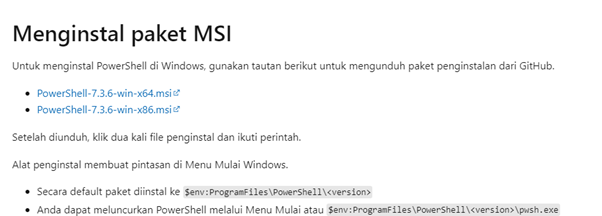
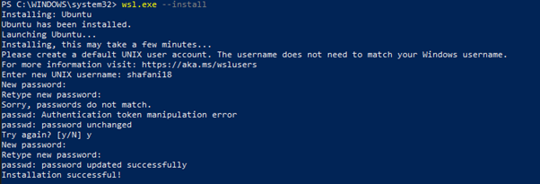
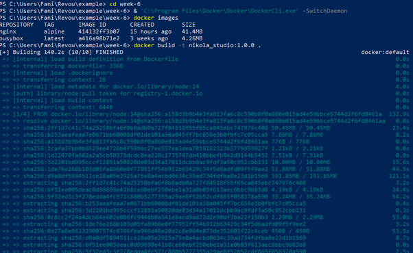
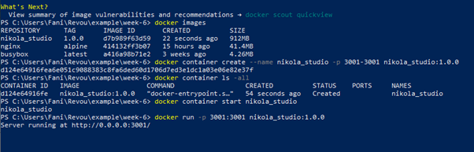
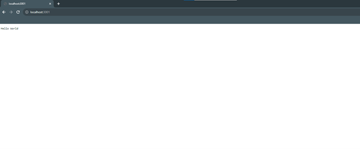

<h1>Week 6 Assignment</h1>

<h1>Table of Content</h1>

    <ul>
        <li>Docker</li>
        <li>Node.js</li>
    </ul>

<h1>Table of File</h1>

    <ul>
        <li>Asset</li>
        <li>App.js</li>
        <li>Docker File</li>
        <li>Package.json</li>
    </ul>

<h1>Instalation Windows Powershell</h1>
 <h2>Download Powershell <a href="https://learn.microsoft.com/id-id/powershell/scripting/install/installing-powershell-on-windows?view=powershell-7.3/">here</a></h2>
 
    <ul>
        <li>After download you must install the Windows powershell</li>
    </ul>

<h2>Install WSL</h2>
 

<h1>Instalation Docker</h1>
 <h2>Download Docker <a href="https://www.docker.com/products/docker-desktop/">here</a></h2>
 
    <ul>
        <li>After download you must install the docker</li>
    </ul>

<h1>Create Images in Docker</h1>
 <h2>Type '''docker build -t nikola_studio:1.0.0'''</h2>
 

<h1>Create Container in Docker</h1>
<h2>Type '''docker container create --name nikola_studio -p 3001-3001 nikola_studio:1.0.0'''</h2>

<h1>Running in localhost</h1>
<h2>Type '''docker run -p 3001-3001 nikola_studio:1.0.0'''</h2>

 
<H1>This the deployment <a href="">here</a></H1>
 
