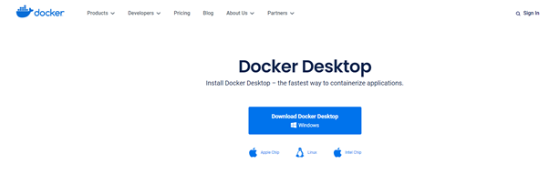

<h1>Week 6 Assignment</h1>

<h1>Table of Content</h1>

    <ul>
        <li>Docker</li>
        <li>Node.js</li>
    </ul>

<h1>Table of File</h1>

    <ul>
        <li>Asset</li>
        <li>App.js</li>
        <li>Docker File</li>
        <li>Package.json</li>
    </ul>

<h1>Instalation Docker</h1>
 <h2>Download Docker <a href="https://www.docker.com/products/docker-desktop/">here</a></h2>
 
    <h3>
        <li>After download you must install the docker</li>
    </h3>
